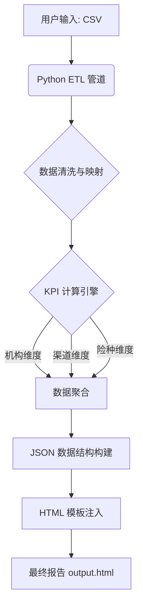

# 项目管理文档：四川分公司车险经营分析系统

## 1. 项目概况
**目标**：构建一个基于 Python 的自动化经营分析报告生成系统。
**核心功能**：读取用户提供的 CSV 源数据，根据预设的 KPI 算法进行复杂计算，并生成交互式 HTML 经营分析报告。
**输入**：`2025保单第49周变动成本明细表.csv` (单文件入口)
**输出**：包含完整交互逻辑的 HTML 报告文件。
**设计风格**：苹果公司风格（极简、高级、数据可视化）。

## 2. 核心架构设计 (Refactoring)

### 2.1 架构图

### 2.2 模块划分
1.  **Loader (`src/data_loader.py`)**: 负责读取 CSV，处理编码、空值填充、字段类型转换。
2.  **Mapper (`src/mapper.py`)**: 负责业务类型映射（基于 `business_type_mapping.json`）和机构名称标准化。
3.  **Calculator (`src/kpi_calculator.py`)**: 核心引擎，实现 `SKILL.md` 中的 16 个核心指标计算逻辑，处理累计值与时间进度。
4.  **Generator (`src/report_generator.py`)**: 读取 HTML 模板，将计算好的 JSON 数据注入，生成最终文件。
5.  **Main (`main.py`)**: 程序入口，协调各模块工作。

## 3. 开发计划

### Phase 1: 核心重构 (Completed)
- [x] 分析 CSV 数据结构与 KPI 算法规则
- [x] 搭建 Python 项目结构
- [x] 实现 ETL 流程 (Loader + Mapper)
- [x] 实现 KPI 计算逻辑 (Calculator)
- [x] 对接 HTML 模板数据接口

### Phase 2: 验证与优化 (Completed)
- [x] 数据准确性核对 (KPIs, Plan Achievement, Thresholds)
- [x] UI 交互测试 (Verified JSON Injection)
- [x] 异常处理与鲁棒性增强 (Error Handling, Missing Data)

### Phase 3: Web 交互层 (Completed)
- [x] 构建 Flask Web 服务器 (`app.py`)
- [x] 设计数据上传页面 (`templates/upload.html`)
- [x] 实现文件上传与处理接口
- [x] 集成后端 ETL 管道

### Phase 4: 场景适配与体验优化 (Completed)
- [x] **数据导入与报告切换**: 在报告页面添加悬浮按钮，支持快速返回上传页面导入新数据。
- [x] **单机构模式优化**: 自动识别单一三级机构数据。
    - 报告标题自动去除"分公司"字样。
    - "分公司KPI"重命名为"关键数据"，标题与内容动态适配主题。
    - 保费进度分析：
        - 标题：展示保费为0的业务类型/客户类别。
        - 正文：展示规模前三的业务类型/客户类别。
        - 图表：仅展示保费大于0的类别。
- [x] **分公司模式增强**: 明确识别 ≥12 个三级机构时的分公司模式（代码已显式处理）。
- [x] **可复刻性增强**: 支持不同周数、不同机构的数据自动适配。

## 4. 关键规则 (来自用户与 SKILL.md)
1.  **数据源单一性**：仅依赖 `2025保单第49周变动成本明细表.csv`。
2.  **KPI 算法强制性**：必须严格遵循 `kpi-calculator` 定义的公式。
    *   时间进度 = 已过天数 / 365
    *   周计划 = 年度目标 / 50
    *   比率指标使用累计值计算
3.  **UI 兼容性**：生成的报告必须达到 `四川分公司车险第49周经营分析模板.html` 的交互标准。

## 5. 待办事项 (Todo)
详见 TodoWrite 工具列表。

## 6. 待优化/扩展 (Pending/Future)
- [ ] **多周模式支持**: 当前仅支持单周累计，未来需扩展支持多周趋势分析（代码已预留接口）。
- [ ] **文档自动化**: 探索从代码注释自动生成部分技术文档。
