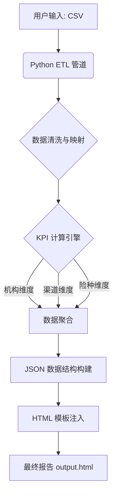

# 经营分析周报生成系统

本项目是一个基于 Python 和 Flask 的自动化经营分析报告生成系统。它能够处理 CSV 格式的车险保单数据，自动进行清洗、映射和 KPI 计算，最终生成交互式的 HTML 报告。

## 系统架构



## 快速开始

### 1. 环境准备

确保您的系统已安装 Python 3.12+。

```bash
# 激活虚拟环境 (macOS/Linux)
source venv/bin/activate
```

### 2. 启动 Web 服务

推荐使用 Web 界面进行操作，简单直观。

```bash
python app.py
```
启动后，浏览器访问 `http://localhost:5000`。

### 3. 生成报告

1.  在浏览器中点击上传区域，选择您的数据文件（CSV格式）。
2.  系统会自动识别数据中的**分公司**和**周数**。
3.  点击上传后，系统将自动进行 ETL 处理和 KPI 计算。
4.  处理完成后，将直接跳转到生成的报告页面。

## 功能特性

*   **多维度分析**：自动生成机构、客户类别（渠道）、业务类型（险种）三个维度的经营分析。
*   **智能识别**：自动从数据中识别所属分公司（如四川、重庆等）和报表周数，无需手动配置。
*   **异常监测**：内置阈值检测逻辑，自动识别成本超标、保费未达标或费用率异常的机构。
*   **交互式图表**：生成的 HTML 报告包含 ECharts 交互式图表，支持下钻和筛选。
*   **完全可复刻**：支持导入不同时间、不同分公司的同构数据，均能正确生成对应报告。

## 数据要求

上传的 CSV 文件需包含以下核心字段（详见 `docs/data-contract.md`）：
*   `signed_premium_yuan` (签单保费)
*   `matured_premium_yuan` (满期保费)
*   `reported_claim_payment_yuan` (已报告赔款)
*   `expense_amount_yuan` (费用额)
*   `second_level_organization` (二级机构，用于识别分公司)
*   `week_number` (周数)
