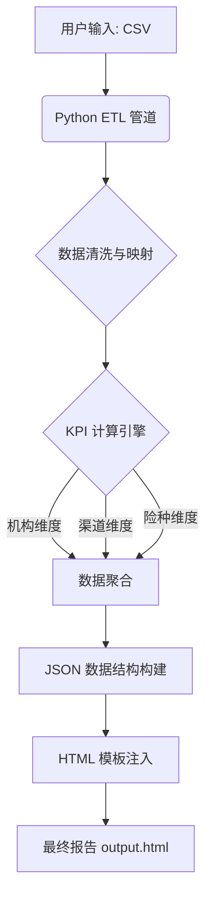

# 架构设计

## 数据流向图

## 模块分层
- CLI/入口：`main.py` 解析参数（数据/模板/输出/周次/年份/机构/映射/阈值/计划）。
- 数据层：`DataLoader` 负责 CSV 加载与必备列校验、数值转换。
- 映射层：`Mapper` 将业务类型标准化（含兼容映射）。
- 计算层：`KPICalculator` 负责指标计算与时间进度推算。
- 组装层：`ReportGenerator` 聚合维度、占比、告警，拼装最终 JSON，并注入模板。
- 模板层：HTML + ECharts，依赖固定 ID/class 进行渲染。

## 关键流程
1) **参数解析**：确定 CSV/模板/输出/配置路径、周次/年份/机构。
2) **数据加载**：加载 CSV，校验必备列；推断周次/年份（可覆盖）。
3) **模式识别**（New）：
   - 检测三级机构数量。
   - 若仅 1 个：标记 `isSingleOrgMode = True`，机构名设为该三级机构。
   - 若 ≥ 12 个：标记 `isSingleOrgMode = False`（分公司模式），机构名默认为“四川”或读取二级机构。
4) **类型映射**：映射业务类型，补充 `ui_short_label`、`ui_category`。
5) **KPI 计算**：计算全局 KPI（含年度计划覆盖），获取总保费/赔款。
6) **聚合分析**：按机构/客户类别/业务类型分组聚合，计算占比与计划达成率。
7) **JSON 构建**：阈值检测生成问题机构，构造包含 `isSingleOrgMode` 的 `DATA` JSON。
8) **模板注入**：替换模板中的 `const DATA = {...};`、标题/日期行，写入输出。

## 配置与可插拔点
- 模板：可通过参数切换不同 HTML；需保留 JS 期望的 ID/class/字段名。
- 映射/阈值/计划：外部 JSON，可按地区/年份分文件，运行时指定。
- 机构名、周次、年份：命令行参数可覆盖自动推断。

## 约束
- 必须遵循数据契约的列名；DOM ID/class 不可随意更改。
- 依赖 Python 3.10+，无外部网络要求。

## 扩展思路
- 支持多模板：定义模板元数据（所需字段、图表类型），通过配置驱动注入。
- 性能优化：大文件使用分块聚合或并行；缓存映射与阈值。
- 日志/监控：为 CLI 增加详细日志级别，输出耗时与缺失映射统计。
