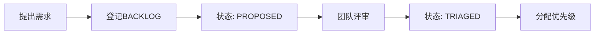
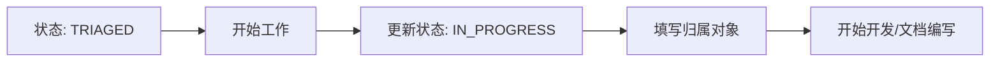
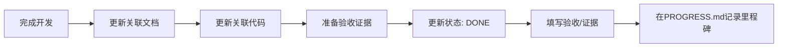
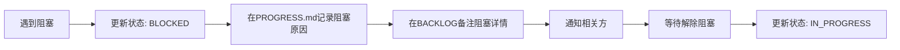

# 📈 进展索引 (PROGRESS_INDEX)

> **唯一入口**: 项目进展追踪与协作状态地图
> **更新时间**: 2026-01-02
> **维护规则**: 所有状态变更必须在此反映；里程碑必须登记

---

## 🎯 快速导航

| 类别 | 入口 | 用途 |
|------|------|------|
| **需求待办** | [BACKLOG.md](../../BACKLOG.md) | 所有需求与任务的待办清单 |
| **进展日志** | [PROGRESS.md](../../PROGRESS.md) | 里程碑、阻塞、下一步接力 |
| **开发日志** | [开发文档/reports/DEVLOG.md](../reports/DEVLOG.md) | 按时间顺序的开发过程记录 |
| **文档地图** | [DOC_INDEX.md](./DOC_INDEX.md) | 返回文档索引 |

---

## 📋 状态机定义

### 统一状态机（所有任务必须遵循）

```
PROPOSED       → 需求提出，待评审
    ↓
TRIAGED        → 已评审，已排优先级，待开始
    ↓
IN_PROGRESS    → 进行中
    ↓
BLOCKED        → 阻塞（需外部输入或决策）
    ↓
DONE           → 已完成（必须有证据）
    ↓
DEPRECATED     → 已废弃（需说明原因）
```

### DONE判定规则（缺一不可）

任何任务标记为 **DONE** 必须同时满足：

1. ✅ **关联文档路径**：必填（指向相关的功能文档、ADR或报告）
2. ✅ **关联代码路径**：
   - 涉及代码变更：必填（文件路径:行号范围）
   - 纯文档任务：可标记 `N/A`
3. ✅ **验收/证据**：必填（至少提供以下之一）
   - PR链接（如 `#123`）
   - Commit哈希（如 `46a8a1c`）
   - 对比报告路径（如 `/开发文档/reports/XXX.md`）
   - 截图路径（如 `/开发文档/reports/screenshots/XXX.png`）

**⚠️ 违规处理**: 校验脚本会自动拦截不符合规则的DONE标记。

---

## 📊 当前项目状态概览

### 功能实施状态（基于KNOWLEDGE_INDEX.md）

| 状态 | 数量 | 功能列表 |
|------|------|---------|
| ✅ **Implemented** | 6 | F001, F002, F003, F004, F006, F008 |
| ✅ **Fully Implemented** | 1 | F007 |
| 🚧 **Implementing** | 1 | F009 |
| ⚠️ **Deprecated** | 1 | F005 |

**详细状态**: 参见 [KNOWLEDGE_INDEX.md](../KNOWLEDGE_INDEX.md)

---

## 🔄 协作工作流

### 1️⃣ 新需求进入流程



**操作步骤**:
1. 在 [BACKLOG.md](../../BACKLOG.md) 新增一行
2. 填写必填字段：ID、提出时间、板块、需求描述、优先级
3. 状态设为 `PROPOSED`
4. 通知团队评审

---

### 2️⃣ 开始执行流程



**操作步骤**:
1. 在 [BACKLOG.md](../../BACKLOG.md) 找到任务行
2. 更新状态为 `IN_PROGRESS`
3. 填写"归属对象"（负责人）
4. 在 [PROGRESS.md](../../PROGRESS.md) 记录开始里程碑

---

### 3️⃣ 完成交付流程



**操作步骤**:
1. 完成代码/文档变更
2. 在 [BACKLOG.md](../../BACKLOG.md) 找到任务行
3. 填写"关联文档"路径
4. 填写"关联代码"路径（或 `N/A`）
5. 填写"验收/证据"（PR链接、commit哈希等）
6. 更新状态为 `DONE`
7. 在 [PROGRESS.md](../../PROGRESS.md) 记录完成里程碑

---

### 4️⃣ 阻塞处理流程



**操作步骤**:
1. 在 [BACKLOG.md](../../BACKLOG.md) 更新状态为 `BLOCKED`
2. 在备注列说明阻塞原因
3. 在 [PROGRESS.md](../../PROGRESS.md) 详细记录阻塞情况
4. 通知相关方（如需决策、外部输入等）

---

## 📖 追踪文档详解

### BACKLOG.md（需求账本）

**用途**: 记录所有需求与任务的完整生命周期

**字段定义**:
| 字段 | 必填 | 说明 | 示例 |
|------|------|------|------|
| ID | ✅ | 唯一任务编号 | `REQ-001` |
| 提出时间 | ✅ | 需求提出日期 | `2026-01-02` |
| 板块 | ✅ | 所属功能板块 | `经营概览板块` |
| 归属对象 | - | 负责人（状态≥IN_PROGRESS时必填） | `@claude` |
| 需求描述 | ✅ | 简短清晰的需求说明 | `优化KPI卡片加载性能` |
| 优先级 | ✅ | P0/P1/P2/P3 | `P1` |
| 状态 | ✅ | 见状态机定义 | `IN_PROGRESS` |
| 关联文档 | 状态=DONE时必填 | 相关文档路径 | `/开发文档/reports/XXX.md` |
| 关联代码 | 状态=DONE时必填（或N/A） | 代码文件路径 | `js/dashboard.js:123-145` |
| 验收/证据 | 状态=DONE时必填 | PR/commit/报告 | `#123`, `46a8a1c` |

**示例**:
```markdown
| ID | 提出时间 | 板块 | 归属对象 | 需求描述 | 优先级 | 状态 | 关联文档 | 关联代码 | 验收/证据 |
|----|---------|------|---------|---------|--------|------|---------|---------|----------|
| REQ-001 | 2026-01-02 | 经营概览 | @claude | 优化KPI卡片加载性能 | P1 | DONE | /开发文档/reports/PERF_OPT.md | js/dashboard.js:82-106 | 46a8a1c |
```

---

### PROGRESS.md（进展日志）

**用途**: 记录里程碑、阻塞事件、下一步接力入口

**记录原则**:
- ✅ **只记录关键节点**：启动、里程碑、阻塞、完成
- ❌ **避免叙事散文**：不写详细过程，只记录状态转换
- ✅ **状态机思维**：每条记录对应一次状态变更
- ✅ **接力入口**：每个里程碑必须说明"下一步做什么"

**示例**:
```markdown
## 2026-01-02

### ✅ 里程碑
- **[REQ-001]** 完成KPI卡片性能优化，加载时间从2.5s降至0.8s
  - 证据: commit `46a8a1c`
  - 下一步: 集成到主分支并部署测试

### 🚧 阻塞
- **[REQ-003]** 等待业务方确认新增指标的计算口径
  - 阻塞原因: 需要业务方提供"客户分层"维度的定义
  - 负责人: @业务团队
  - 预计解除: 2026-01-05

### 🎯 下一步接力
- **[REQ-002]** 继续开发下钻筛选器的多选联动功能
  - 当前进度: 50%
  - 入口: `js/dashboard.js:1500-1600`
```

---

## 🔍 进展查询指南

### 如何查找某个功能的状态？
1. 打开 [KNOWLEDGE_INDEX.md](../KNOWLEDGE_INDEX.md)
2. 搜索功能ID（如 `F008`）
3. 查看状态列（✅ implemented / 🚧 implementing 等）

### 如何查找某个需求的进展？
1. 打开 [BACKLOG.md](../../BACKLOG.md)
2. 搜索需求ID（如 `REQ-001`）或关键词
3. 查看状态列（PROPOSED / IN_PROGRESS / DONE 等）

### 如何查找最近的开发活动？
1. 打开 [PROGRESS.md](../../PROGRESS.md)
2. 查看最新日期的记录
3. 查看"下一步接力"了解待办事项

### 如何查找某个人的任务？
1. 打开 [BACKLOG.md](../../BACKLOG.md)
2. 搜索"归属对象"列（如 `@claude`）
3. 筛选状态为 `IN_PROGRESS` 的任务

---

## 🔄 索引更新协议

### 必须更新索引的场景
1. **状态变更**：任何任务状态改变都必须同步到BACKLOG.md和PROGRESS.md
2. **新增需求**：必须先登记到BACKLOG.md，状态为PROPOSED
3. **里程碑达成**：必须在PROGRESS.md记录
4. **阻塞/解除阻塞**：必须在PROGRESS.md记录并更新BACKLOG状态

### 自动化支持
- **校验脚本**: `scripts/check-governance.mjs` 会自动检查DONE条目的证据完整性
- **Git Hook**: 提交前自动运行校验（未来可选）

---

## 📌 维护注意事项

- **禁止删除历史记录**：PROGRESS.md的历史里程碑不可删除，只能追加
- **禁止跳跃状态**：状态必须按状态机顺序转换（不能从PROPOSED直接到DONE）
- **强制证据链**：DONE状态必须有完整证据，否则校验不通过
- **及时同步**：代码合并后24小时内必须更新BACKLOG和PROGRESS

---

**最后更新**: 2026-01-02
**维护者**: autowrKPI Governance Team
